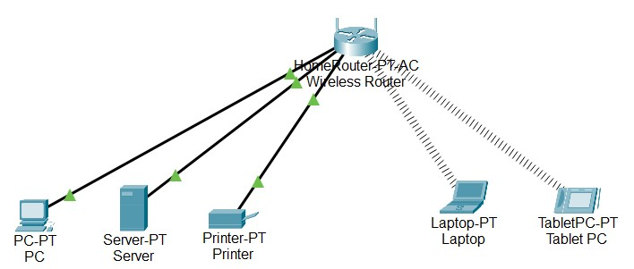

# Home ↔ ISP Topology (Packet Tracer)
## Overview
A home LAN (wired + Wi-Fi) connects to an ISP router, which uplinks to an “Internet” server.  
The Home Router provides DHCP, NAT, and wireless access.

## Diagram

## Devices & Roles
- **Various End Devices:**  
  - PC0 (Home PC1)  
  - Server0 (Home Server)  
  - Printer0 (Home Network Printer)  
  - Laptop0 (Home Owner's Laptop)  
  - Tablet0 (Home Owner's Guest's Tablet)  

- **Home Router (Wireless Router-PT AC):**  
  - LAN gateway, DHCP server, NAT, Wi-Fi AP  

- **ISP Router (Router-PT, Router0):**  
  - Provider edge between home and server  

- **Server (Server-PT, Server0):**  
  - Simulated Internet host  

## Networks
- **Home LAN1:** `192.168.10.0/24` or `255.255.255.0` (PC, wired connection)  
- **Home LAN2:** `192.168.20.0/24` or `255.255.255.0` (Server, wired connection)
- **Home LAN3:** `192.168.30.0/24` or `255.255.255.0` (Printer, wired connection)  
- **Home WLAN1:** `192.168.40.0/24` or `255.255.255.0` (Home Wi-Fi Network)  
- **Home WLAN2:** `192.168.50.0/24` or `255.255.255.0` (Guest Wi-Fi Network)  
- **Internet:** `x.x.x.x/xx` or `x.x.x.x` (Connection to ISP)  
---
## Addressing Table (Baseline)
| Device            | Interface          | IP Address       | Subnet Mask     | Default Gateway |
|-------------------|--------------------|------------------|-----------------|-----------------|
| Home PC           | GigabitEthernet 1  | DHCP             |                 | 192.168.10.1    |
| Home Server       | GigabitEthernet 2  | 192.168.20.100   |                 | 192.168.20.1    |
| Home Printer      | GigabitEthernet 3  | 192.168.30.100   |                 | 192.168.30.1    |
| Wireless Router   | LAN (Port 1)       | 192.168.10.1     | 255.255.255.0   |                 |
| Wireless Router   | LAN (Port 2)       | 192.168.20.1     | 255.255.255.0   |                 |
| Wireless Router   | LAN (Port 3)       | 192.168.30.1     | 255.255.255.0   |                 |
| Wireless Router   | WLAN (SSID 1)      | 192.168.40.1     | 255.255.255.0   |                 |
| Wireless Router   | WLAN (SSID 2)      | 192.168.50.1     | 255.255.255.0   |                 |
| Wireless Router   | Internet           | DHCP             |                 |                 |
| Laptop            | Wireless 1         | DHCP             |                 |                 |
| Tablet            | Wireless 2         | DHCP             |                 |                 |

---
## DHCP Server (Home Router)
- **LAN1 Pool:** `192.168.10.100 – 192.168.10.199` (GW: `192.168.10.1`)  
- **WLAN1 Pool:** `192.168.30.100 – 192.168.30.199` (GW: `192.168.30.1`)  
- **WLAN2 Pool:** `192.168.40.100 – 192.168.40.199` (GW: `192.168.40.1`)  

## Routing
### Home Router
to be added at some point

### CISCO Router Configuration
to be added at some point

## DNS
To be added at some point
