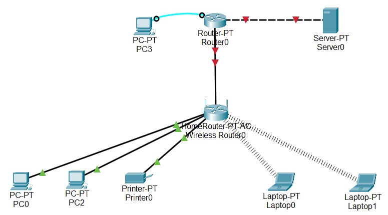

# Home ↔ ISP Topology (Packet Tracer)
## Overview
A home LAN (wired + Wi-Fi) connects to an ISP router, which uplinks to an “Internet” server.  
The Home Router provides DHCP, NAT, and wireless access.

## Diagram

## Devices & Roles
- **Various End Devices:**  
  - PC0 (Home PC1)  
  - PC1 (Home PC2)  
  - PC2 (management PC connected to the ISP router via console cable)  
  - Printer0 (Home Network Printer)  
  - Laptop0 (Home Owner's Laptop)  
  - Laptop1 (Home Owner's Guest's Laptop)  

- **Home Router (Wireless Router-PT AC):**  
  - LAN gateway, DHCP server, NAT, Wi-Fi AP  

- **ISP Router (Router-PT, Router0):**  
  - Provider edge between home and server  

- **Server (Server-PT, Server0):**  
  - Simulated Internet host  

## Networks
- **Home LAN1:** `192.168.10.0/24` or `255.255.255.0` (PCs, wired connection)  
- **Home LAN2:** `192.168.20.0/24` or `255.255.255.0` (Printer, wired connection)  
- **Home WLAN1:** `192.168.30.0/24` or `255.255.255.0` (Home Wi-Fi Network)  
- **Home WLAN2:** `192.168.40.0/24` or `255.255.255.0` (Guest Wi-Fi Network)  
- **ISP LAN3:** `10.0.0.0/30` or `255.255.255.252` (ISP's network Home Router connects to)  
- **ISP WAN:** to be added at some point (connection to a distant server, WWW simulation)

## Interfaces / IP Assignment
| Interface         | IP assignment     | Gateway IP           |
|-------------------|-------------------|----------------------|
| **Home LAN1**     | DHCP              | `192.168.10.1 /24`   |
| **Home LAN2**     | Static            | `192.168.20.1 /24`   |
| **Home WLAN1**    | DHCP              | `192.168.30.1 /24`   |
| **Home WLAN2**    | DHCP              | `192.168.40.1 /24`   |
| **ISP LAN3**      | Static            | `10.0.0.1 /30`       |
| **ISP WAN**       | To be added...    | To be added...       |

## DHCP Server (Home Router)
- **LAN1 Pool:** `192.168.10.100 – 192.168.10.199` (GW: `192.168.10.1`)  
- **WLAN1 Pool:** `192.168.30.100 – 192.168.30.199` (GW: `192.168.30.1`)  
- **WLAN2 Pool:** `192.168.40.100 – 192.168.40.199` (GW: `192.168.40.1`)  

## Routing
### Home Router
to be added at some point

### CISCO Router Configuration
to be added at some point

## DNS
To be added at some point
